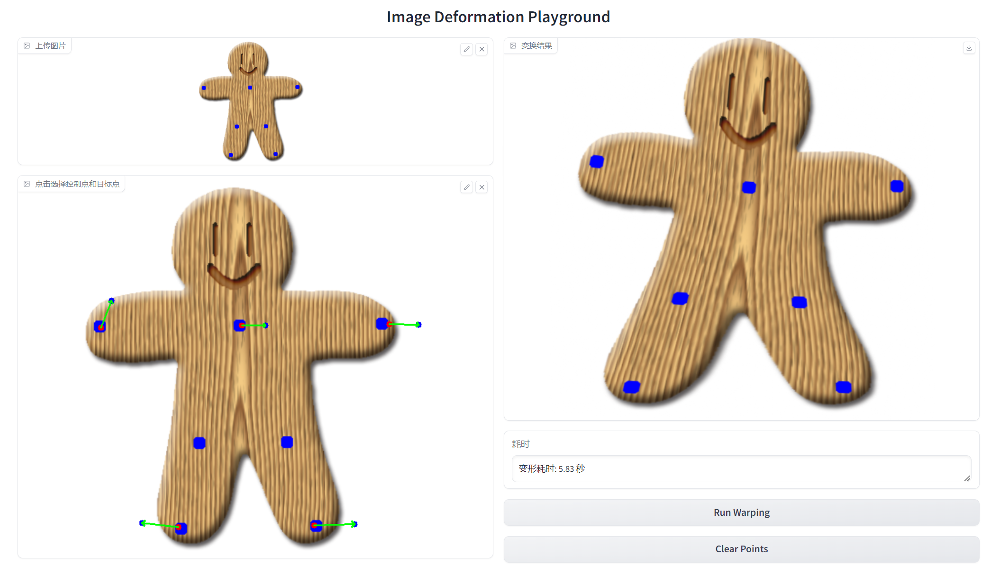

# Assignment 1 - Image Warping

### In this assignment, you will implement basic transformation and point-based deformation for images.

### Resources:
- [Teaching Slides](https://rec.ustc.edu.cn/share/afbf05a0-710c-11ef-80c6-518b4c8c0b96) 
- [Paper: Image Deformation Using Moving Least Squares](https://people.engr.tamu.edu/schaefer/research/mls.pdf)
- [Paper: Image Warping by Radial Basis Functions](https://www.sci.utah.edu/~gerig/CS6640-F2010/Project3/Arad-1995.pdf)
- [OpenCV Geometric Transformations](https://docs.opencv.org/4.x/da/d6e/tutorial_py_geometric_transformations.html)
- [Gradio: 一个好用的网页端交互GUI](https://www.gradio.app/)

### 1. Basic Image Geometric Transformation (Scale/Rotation/Translation).
Fill the [Missing Part](run_global_transform.py#L21) of 'run_global_transform.py'.


### 2. Point Based Image Deformation.

Implement MLS or RBF based image deformation in the [Missing Part](run_point_transform.py#L52) of 'run_point_transform.py'.

---

## Implementation of Image Geometric Transformation

This repository is Chucheng Xiang's implementation of Assignment_01 of DIP. My student ID is SA24001058.




## Environment

- OS: Windows, macOS, Linux
- Python: 3.10

## Installation
Following the cloning of the repository, it is essential to verify that Python 3.10 is installed on your system and that you are currently located in the <font color="red">root directory</font> of this repository. Subsequently, you can proceed to install the necessary dependencies by executing the commands below:

1. To create virtual environment and activate it:

On Windows:
```cmd
python -m venv dip_env
dip_env\Scripts\activate
```

On macOS/Linux:
```bash
python3 -m venv dip_env
source dip_env/bin/activate
```

2. To install requirements:

```cmd
pip install -r requirements.txt
```

## Usage

### Basic Transformation
To use basic transformation, run:

```cmd
python Assignments\01_ImageWarping\run_global_transform.py
```

### point guided transformation
Image warping algorithm based on MLS (Moving Least Square) can be read in [mls_algorithm](mls_algorithm.md).

To use point guided transformation, run:

```cmd
python Assignments\01_ImageWarping\run_point_transform.py
```

To use fast (using vectorization) point guided transformation, run:

```cmd
python Assignments\01_ImageWarping\run_point_transform_fast.py
```

Then, you can utilize the interface developed by Gradio, which is accessible at http://127.0.0.1:7860.

To virtualize the shape of transformed points, run:

```cmd
python Assignments\01_ImageWarping\point_virtualization.py
```


## Results
### Basic Transformation


### Point Guided Deformation:


## Note

To avoid the singularity problem of transformation matrix, it is important to choose at least 3 control points for the image warping algorithm based on MLS.

## Acknowledgement

>📋 Thanks for the algorithms proposed by [Image Deformation Using Moving Least Squares](https://people.engr.tamu.edu/schaefer/research/mls.pdf).