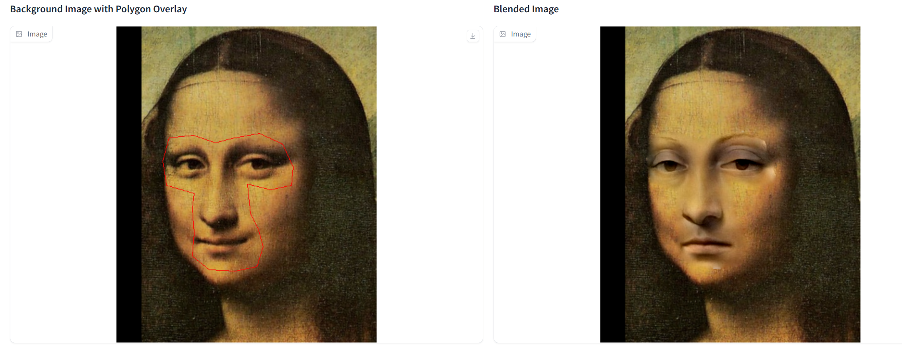
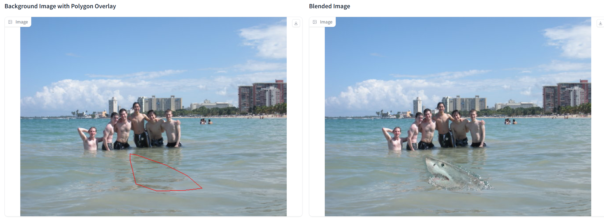

# Assignment 2 - DIP with PyTorch

### In this assignment, you will implement traditional DIP (Poisson Image Editing) and deep learning-based DIP (Pix2Pix) with PyTorch.

### Resources:
- [Assignment Slides](https://rec.ustc.edu.cn/share/705bfa50-6e53-11ef-b955-bb76c0fede49)  
- [Paper: Poisson Image Editing](https://www.cs.jhu.edu/~misha/Fall07/Papers/Perez03.pdf)
- [Paper: Image-to-Image Translation with Conditional Adversarial Nets](https://phillipi.github.io/pix2pix/)
- [Paper: Fully Convolutional Networks for Semantic Segmentation](https://arxiv.org/abs/1411.4038)
- [PyTorch Installation & Docs](https://pytorch.org/)

---

### 1. Implement Poisson Image Editing with PyTorch.
Fill the [Polygon to Mask function](run_blending_gradio.py#L95) and the [Laplacian Distance Computation](run_blending_gradio.py#L115) of 'run_blending_gradio.py'.


### 2. Pix2Pix implementation.
See [Pix2Pix subfolder](Pix2Pix/).


### Requirements:
- 请自行环境配置，推荐使用[conda环境](https://docs.anaconda.com/miniconda/)
- 按照模板要求写Markdown版作业报告


---

## Implementation

This repository is Chucheng Xiang's implementation of Assignment_02 of DIP. My student ID is SA24001058.

### Environment

- OS: Windows, macOS, Linux
- Python: 3.10

### Installation
Following the cloning of the repository, it is essential to verify that Python 3.10 is installed on your system and that you are currently located in the <font color="red">root directory</font> of this repository. Subsequently, you can proceed to install the necessary dependencies by executing the commands below:

1. To create virtual environment and activate it:

```bash
conda create -n dip python=3.10
conda activate dip
```

2. To install requirements:

```bash
pip install -r requirements.txt
```

3. To check the CUDA version:

```bash
nvcc --version
```

4. To install PyTorch (CUDA 12.4):

```bash
pip install torch torchvision torchaudio --index-url https://download.pytorch.org/whl/cu124
```

However, the download speed of PyTorch from the official website is very slow, so I recommend manually download the PyTorch package (https://download.pytorch.org/whl/cu124/torch-2.5.0%2Bcu124-cp310-cp310-win_amd64.whl) and install it.


### Usage

#### Poisson Image Editing

**Algorithm Description**

Let the source image be \( f^* \), the target image be \( f \), and the mask be \( \Omega \).
We want to minimize the loss function:

$$
\min_{f} \int_{\Omega} |\nabla f - \nabla f^*| ^2\mathrm{d}\Omega,\, \text{with}\, f|_{\partial \Omega} = g|_{\partial \Omega}.
$$

We use Adam optimizer in Pytorch to optimize the loss function.

To run the Poisson Image Editing with Pytorch:

```bash
python Assignments/02_DIPwithPyTorch/run_blending_gradio.py
```

Then, you can utilize the interface developed by Gradio, which is accessible at http://127.0.0.1:7860.

The loss function convergence strategy is that the change of the loss function within 100 iterations does not exceed the threshold value (1e-9), and the total iteration numbers is usually around 1e4.

#### Pix2Pix
The model architecture is based on Fully Convolutional Networks (FCNs), whose detailed design can be seen in [FCN_network.py](Pix2Pix/FCN_network.py).

To train the model, you should download the dataset first by running:

```bash
bash Assignments/02_DIPwithPyTorch/Pix2Pix/download_facades_dataset.sh
```

Then, you can train the model by running:
```bash
python Assignments/02_DIPwithPyTorch/Pix2Pix/train.py
```

### Results

#### Poisson Image Editing with Pytorch
We can blend Mona Lisa's face with Ginevra de' Benci's expression:

Conversely, we can also let Ginevra de' Benci have Mona Lisa's smile:

In addition, we can put a shark in front of some men to give them a scare:

Finally, it is also interesting to see a bear swimming in the ocean:


**Analysis**
Overall, the results are satisfactory. However, there are still some inconsistencies in the fused images, such as the color of the face and the background, and the overall effect is not very natural.

#### Pix2Pix

**Model Settings**
- Dataset: [Facades](https://cmp.felk.cvut.cz/~tylecr1/facade/) (400 images, 256x256 resolution)
- Loss Function: L1 Loss
- Batch Size: 256
- Epoch: 200
- Optimizer: Adam with initial learning rate 0.001
- Scheduler: StepLR with step size 20 and gamma 0.2

**Train Results**
We choose a few results generated by the model during the training process:


**Validation Results**
We pick some results generated by the model on the validation set:


**Analysis**
It can be clearly seen that the model has learned to generate some outline features of the building facade and the results are similar to the ground truth to some extent.

**Loss Curve**


*Initial Loss*: Both the training loss (blue line) and validation loss (orange line) start at high values at epoch 0. This is typical for deep learning models as they begin with random weight initialization.

*Rapid Decline*: In the initial stages of training (up to around 25 epochs), both train loss and validation loss decrease rapidly. This is indicative of the model learning effectively from the training data.

*Convergence*: After around 50 epochs, the training loss and validation loss begin to plateau. This indicates that the model is approaching convergence, where further training does not significantly reduce the loss. The loss values stabilize around 0.32 for the training loss and 0.38 for the validation loss by the end of 200 epochs.

*Overfitting or Underfitting*: The fact that the validation loss closely follows the training loss after the initial decline suggests that the model is not overfitting or underfitting significantly. Overfitting would typically be indicated by the validation loss increasing after a certain number of epochs, while underfitting would be indicated by both train and validation losses being high.

*Model Performance*: The final loss values indicate that the model has achieved a reasonable level of performance on both the training and validation sets. The small gap between the two losses suggests that the model generalizes well to unseen data.

**Larger Dataset**
To improve the performance of the model, we try a bigger dataset [Cityscapes](https://www.cityscapes-dataset.com/) with 2975 images, 256x256 resolution. Epochs is set to 400 and the other model settings are as the same as the previous one.

**Train Results**
We choose a few results generated by the model during the training process:


**Validation Results**
We pick some results generated by the model on the validation set:


**Analysis**
The model has a certain ability to identify objects in the cityscape scene, such as people, cars, trees, etc. However, the results are still not entirely satisfactory, because the edge lines of the objects are not clear at all.

**Loss Curve**


*Initial Loss*: Both the training loss (blue line) and validation loss (orange line) start at relatively high values at epoch 0. The initial training loss is around 0.42, while the validation loss is around 0.38.

*Rapid Decay*: In the early stages of training (up to around 50 epochs), both losses decrease rapidly. This indicates that the model is learning quickly during this period. The training loss drops significantly, reaching around 0.10 by epoch 50, while the validation loss also decreases but at a more up-and-down pace, reaching approximately 0.12 at epoch 50.

*Convergence*: After the initial rapid decline, both losses plateau and stabilize. The training loss stabilizes at around 0.05 after about 150 epochs, and the validation loss remains relatively constant at around 0.12 after epoch 100. This indicates that the model has converged and is no longer experiencing significant changes in loss.

*Overfitting*: The validation loss remains slightly higher than the training loss throughout the training process. This suggests that the model may be overfitting to the training data to some extent, as the validation loss does not reach the same low levels as the training loss. However, the difference between the two losses is not excessive, indicating that the model performs reasonably well on unseen data.

Overall Behavior: The overall behavior of the loss curves is encouraging, showing that the model is able to learn effectively and converge to a reasonable solution. The stability of the validation loss after convergence also suggests that the model is not overfitting severely.
