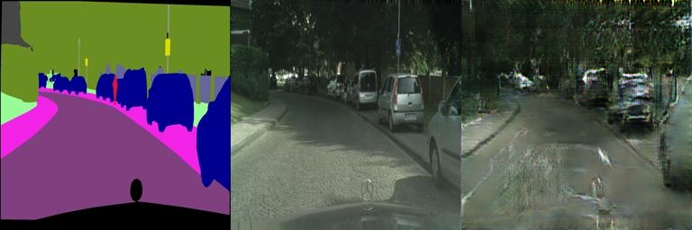

# Assignment 3 - Play with GANs

### In this assignment, you will implement two methods for using GANs in digital image processing.

### Resources:

- [DragGAN](https://vcai.mpi-inf.mpg.de/projects/DragGAN/): [Implementaion 1](https://github.com/XingangPan/DragGAN) & [Implementaion 2](https://github.com/OpenGVLab/DragGAN)
- [Facial Landmarks Detection](https://github.com/1adrianb/face-alignment)

---

See [作业03-Play_with_GANs.pptx](https://rec.ustc.edu.cn/share/705bfa50-6e53-11ef-b955-bb76c0fede49) for detailed requirements.

---

## Implementation

This repository is Chucheng Xiang's implementation of Assignment_03 of DIP. My student ID is SA24001058.

### 1. Photorealistic Generation from Segmentation Map via GAN Network

#### Environment

- OS: Linux
- Python: 3.10

#### Installation

Following the cloning of the repository, you can install the necessary dependencies by executing the commands below:

1. To create virtual environment and activate it:

```bash
conda create -n dip python=3.10
conda activate dip
```

2. To install requirements:

```bash
pip install -r requirements.txt
```

3. To check the CUDA version:

```bash
nvcc --version
```

4. To install PyTorch (CUDA 12.4):

```bash
pip install torch torchvision torchaudio --index-url https://download.pytorch.org/whl/cu124
```

However, the download speed of PyTorch from the official website might be very slow, so I recommend manually download the PyTorch package (https://download.pytorch.org/whl/cu124/torch-2.5.0%2Bcu124-cp310-cp310-win_amd64.whl) and install it directly.

#### Usage

After downloading the datasets, you can run the following command to train the model:

```bash
cd Assignments/03_PlayWithGANs
python Pix2Pix/train.py
```

Then you can see the training process in the terminal, while the checkpoints, logs and generated images will be saved in the `checkpoints`, `logs` and `train(val)_results` folders.

#### Results

Here are some generated images:




From the images above, we can see that the generated images are quite fuzzy, distorted, with a lot of artifacts. Althougn I have tried many strategies, including **Skip Connections**, **Residual Blocks**, **Attention Mechanism**, etc., the results are still not satisfactory. The loss curve is shown below:


I think why the results are not satisfactory is that the generator and discriminator are not powerful enough.

### 2. AutoDragGAN: Combination of Face-Alignment and DragGAN

Our idea is to combine the face-alignment and DragGAN. Specifically, we first use the face-alignment model to detect the facial landmarks of the input human face image, and then define some common deformations, such as "smiling", "frowning", "closing mouth", etc. These deformations are represented by the small movements of some facial landmarks. Finally, we input these deformations into the DragGAN model to generate the naturally deformed face image.

#### Environment

- OS: Linux
- Python: 3.9
- Dependencies: follow the instructions in [DragGAN](https://github.com/OpenGVLab/DragGAN).

#### Usage

I made a [gradio interface](auto_DragGAN/app.py) for user to directly upload one image, choose the deformation type and see the result. Normally, you only need to run the following command:

```bash
cd Assignments/03_PlayWithGANs
python auto_DragGAN/app.py
```

Then you can utilize the interface which is accessible at http://127.0.0.1:7860.

However, I encountered a very strange bug that I do not understand and cannot solve. When I run the command above, the interface can be displayed, but cannot call the function. I have taken much time to debug but still cannot find the reason. By the way, it took me a lot of time to configure a environment that can run DragGAN.

#### Results

The results of facial landmark detection is convenient and correct:

<p float="left">
  
  
</p>

<p float="left">
  
  
</p>

However, It is quite strange that the deformed images based on the detected landmarks via DragGAN are the same:


I suspect that there is a problem with the code, the random seed of the generation model is fixed. And the current generator only depends on the fixed latent code, so the output image does not consider the characteristics of the input image.

Maybe we need GAN inversion technology to map the input image to the latent space, and then obtain the corresponding latent code which can be used to generate the deformed image via DragGAN.

---

**Updates:**

According to the official documentation: "This GUI supports editing GAN-generated images. To edit a real image, you need to first perform GAN inversion using tools like [PTI](https://github.com/danielroich/PTI). Then load the new latent code and model weights to the GUI.", it really needs GAN inversion to edit a real image like the man's portrait shown above.

For simplicity, I only implemented the function of editing GAN-generated images. With the following command, you can open the visualization interface and edit the image:

```bash
cd Assignments/03_PlayWithGANs/auto_DragGAN/DragGAN
python visualizer_drag.py checkpoints/stylegan2-ffhq-512x512.pkl
```

I define four facial deformations: "Smile", "Face lift", "Open mouth", "Close mouth", with the results shown below:


<p align="center">Recognized face landmarks</p>


<p align="center">Smile</p>


<p align="center">Face lift</p>


<p align="center">Open mouth</p>


<p align="center">Close mouth</p>

