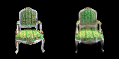

# Assignment 4 - Implement Simplified 3D Gaussian Splatting

This assignment covers a complete pipeline for reconstructing a 3D scene represented by 3DGS from multi-view images. The following steps use the [chair folder](data/chair); you can use any other folder by placing images/ in it.

### Resources:

- [Paper: 3D Gaussian Splatting](https://repo-sam.inria.fr/fungraph/3d-gaussian-splatting/)
- [3DGS Official Implementation](https://github.com/graphdeco-inria/gaussian-splatting)
- [Colmap for Structure-from-Motion](https://colmap.github.io/index.html)

---

### Step 1. Structure-from-Motion

First, we use Colmap to recover camera poses and a set of 3D points. Please refer to [11-3D_from_Multiview.pptx](https://rec.ustc.edu.cn/share/705bfa50-6e53-11ef-b955-bb76c0fede49) to review the technical details.

```
python mvs_with_colmap.py --data_dir data/chair
```

Debug the reconstruction by running:

```
python debug_mvs_by_projecting_pts.py --data_dir data/chair
```

### Step 2. A Simplified 3D Gaussian Splatting (Your Main Part)

From the debug output of Step 1, you can see that the 3D points are sparse for rendering the whole image. We will expand each point to a 3D Gaussian to make it cover more 3D space.

#### 2.1 3D Gaussians Initialization

Refer to the [original paper](https://repo-sam.inria.fr/fungraph/3d-gaussian-splatting/3d_gaussian_splatting_low.pdf). For converting 3D points to 3D Gaussians, we need to define the covariance matrix for each point; the initial Gaussians' centers are just the points. According to equation (6), for defining covariance, we define a scaling matrix S and a rotation matrix R. Since we need to use the 3D Gaussians for volume rendering, we also need the opacity attribute and the color attribute for each Gaussian. The volume rendering process is formulated with equations (1), (2), (3). [The code here](gaussian_model.py#L32) contains functions to initialize these attributes as optimizable parameters. You need to fill [the code here](gaussian_model.py#L132) for computing the 3D Covariance matrix from the quaternion (for rotation) and the scaling parameters.

#### 2.2 Project 3D Gaussians to Obtain 2D Gaussians

According to equation (5), we need to project the 3D Gaussians to the image space by transforming with the world to camera transformation *_W_* and the Jacobian matrix *_J_* of the projection transformation. You need to fill [the code here](gaussian_renderer.py#L26) for computing the projection.

#### 2.3 Compute the Gaussian Values

We need to compute 2D Gaussians for volume rendering. A 2D Gaussian is represented by:

$$
f(\mathbf{x}; \boldsymbol{\mu}\_{i}, \boldsymbol{\Sigma}\_{i}) = \frac{1}{2 \pi \sqrt{ | \boldsymbol{\Sigma}\_{i} |}} \exp \left ( {-\frac{1}{2}} (\mathbf{x} - \boldsymbol{\mu}\_{i})^T \boldsymbol{\Sigma}\_{i}^{-1} (\mathbf{x} - \boldsymbol{\mu}\_{i}) \right ) = \frac{1}{2 \pi \sqrt{ | \boldsymbol{\Sigma}\_{i} |}} \exp \left ( P_{(\mathbf{x}, i)} \right )
$$

Here, $\mathbf{x}$ is a 2D vector representing the pixel location, $\boldsymbol{\mu}$ represents a 2D vector representing the mean of the $i$-th 2D Gaussian, and $\boldsymbol{\Sigma}$ represents the covariance of the 2D Gaussian. The exponent part $P_{(\mathbf{x}, i)}$ is:

$$
P_{(\mathbf{x}, i)} = {-\frac{1}{2}} (\mathbf{x} - \boldsymbol{\mu}\_{i})^T \mathbf{\Sigma}\_{i}^{-1} (\mathbf{x} - \boldsymbol{\mu}\_{i})
$$

You need to fill [the code here](gaussian_renderer.py#L83) for computing the Gaussian values.

#### 2.4 Volume Rendering (α-blending)

According to equations (1-3), using these `N` ordered 2D Gaussians, we can compute their alpha and transmittance values at each pixel location in an image.

The alpha value of a 2D Gaussian $i$ at a single pixel location $\mathbf{x}$ can be calculated using:

$$
\alpha_{(\mathbf{x}, i)} = o_i*f(\mathbf{x}; \boldsymbol{\mu}\_{i}, \boldsymbol{\Sigma}\_{i})
$$

Here, $o_i$ is the opacity of each Gaussian, which is a learnable parameter.

Given `N` ordered 2D Gaussians, the transmittance value of a 2D Gaussian $i$ at a single pixel location $\mathbf{x}$ can be calculated using:

$$
T_{(\mathbf{x}, i)} = \prod_{j \lt i} (1 - \alpha_{(\mathbf{x}, j)})
$$

Fill [the code here](gaussian_renderer.py#L139) for final rendering computation.

After implementation, build your 3DGS model:

```
python train.py --colmap_dir data/chair --checkpoint_dir data/chair/checkpoints
```

### Compare with the original 3DGS Implementation

Since we use a pure PyTorch implementation, the training speed and GPU memory usage are far from satisfactory. Also, we do not implement some crucial parts like adaptive Gaussian densification scheme. Run the [original 3DGS implementation](https://github.com/graphdeco-inria/gaussian-splatting) with the same dataset to compare the results.

---

## Implementation

This repository is Chucheng Xiang's implementation of Assignment_04 of DIP. My student ID is SA24001058.

### Environment

- OS: Linux (Ubuntu 22.04)
- Python: 3.10
- CUDA: 12.4

### Installation

Following the cloning of the repository, you can install the necessary dependencies by executing the commands below:

1. To create virtual environment and activate it:

```bash
conda create -n dip python=3.10
conda activate dip
```

2. To install requirements:

```bash
pip install -r requirements.txt
```

3. To check the CUDA version:

```bash
nvcc --version
```

4. To install PyTorch (CUDA 12.4):

```bash
pip install torch torchvision torchaudio --index-url https://download.pytorch.org/whl/cu124
```

However, the download speed of PyTorch from the official website might be very slow, so I recommend manually download the PyTorch package (https://download.pytorch.org/whl/cu124/torch-2.5.0%2Bcu124-cp310-cp310-win_amd64.whl) and install it directly.

5. To install COLMAP, run:

```bash
sudo apt update
sudo apt install colmap
```

6. To install pytorch3d, run:

```bash
conda install -c fvcore -c iopath -c conda-forge fvcore iopath
conda install pytorch3d
```

### Usage

First, use Colmap to recover camera poses and a set of 3D points.

```bash
python mvs_with_colmap.py --data_dir data/chair
```

Then, you can run the following command to train the model:

```bash
cd Assignments/04_3DGS
python train.py --colmap_dir data/chair --checkpoint_dir data/chair/checkpoints
```

### Results

For dataset "chair", here are some rendered images in different epochs:

<table>
<tr>
<td></td>
<td></td>
<td></td>
<td></td>
</tr>
<tr>
<td align="center">Epoch 1</td>
<td align="center">Epoch 10</td>
<td align="center">Epoch 50</td>
<td align="center">Epoch 200</td>
</tr>
</table>

At the beginning of the training, the results of the rendering are still very vague, and there is a large gap with the original image, but there are already some structural similarities. With the increase of the epoch, the results gradually approach the original image. The training loss curve is shown below:


Additionally, here is a gif showing the rendering results in different views:


For dataset "lego", here are some rendered images in different epochs:

<table>
<tr>
<td></td>
<td></td>
<td></td>
<td></td>
</tr>
<tr>
<td align="center">Epoch 1</td>
<td align="center">Epoch 10</td>
<td align="center">Epoch 50</td>
<td align="center">Epoch 200</td>
</tr>
</table>

The training loss curve:


The rendering results in different views:


### Compare with the original 3DGS Implementation

For convenience, I follow author's instructions to use a [colab notebook](https://colab.research.google.com/github/camenduru/gaussian-splatting-colab/blob/main/gaussian_splatting_colab.ipynb) provided by a user [camenduru](https://github.com/camenduru) to run the original 3DGS implementation on the 'chair' dataset with the results shown below.

Ground truth images (800x800):

<table>
<tr>
<td></td>
<td></td>
<td></td>
</tr>
</table>

Rendered images (800x800):

<table>
<tr>
<td></td>
<td></td>
<td></td>
</tr>
</table>

The rendered images are so good that I can't see the difference between the ground truth and the rendered images.

Generated 3D point cloud in ply format:


#### Quantitative Comparison

<table>
<tr>
<td>Chair Dataset</td>
<td>PSNR ↑</td>
<td>SSIM ↑</td>
<td>LPIPS ↓</td>
</tr>
<tr>
<td>epoch_200</td>
<td>20.346</td>
<td>0.887</td>
<td>0.079</td>
</tr>
<tr>
<td>original_implementation</td>
<td>34.857</td>
<td>0.993</td>
<td>0.021</td>
</tr>
</table>

As can be seen from the table, the performance of PSNR, SSIM, and LPIPS of the rendered images generated by my implementation is weaker than the original implementation.